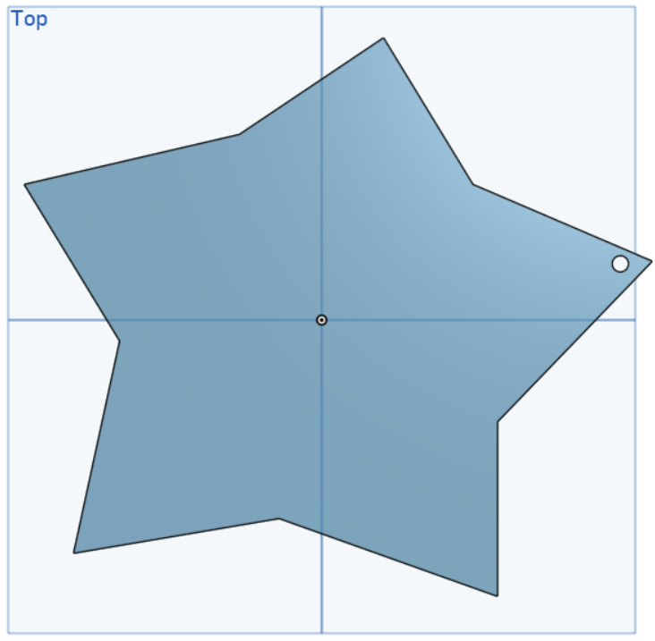
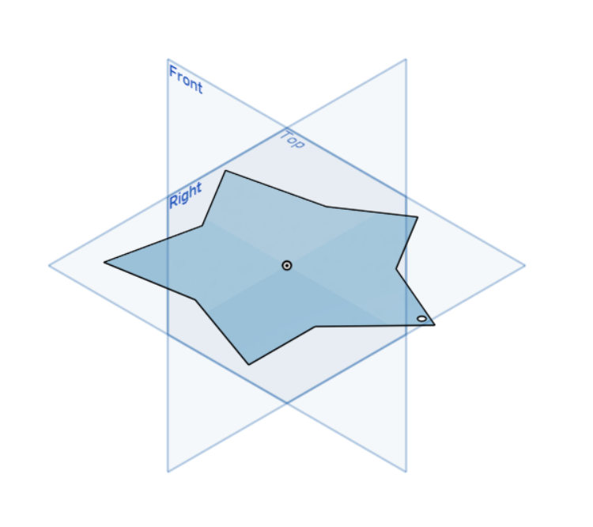

# 3D-Star-Design

A 3D five-pointed star keychain designed using **Onshape** as part of the Smart Methods Summer Training.

## 📐 Specifications

- **Outer Diameter:** 40 mm
- **Key Ring Hole:** 4 mm
- **Thickness:** 2 mm
- **Export Format:** STL

## 📷 Design Views

### Top View

### Isometric View

